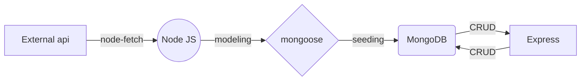

# **Indian Cities REST API (reconstructed)**

##### This is a JSON API with full CRUD functionality that allows users to access a database of Indian cities as well as search all cities by district or state. This project was created for the Software Engineering Immersive Program at General Assembly.

###### UML Diagram



## Features:

###### You can either request an array of all cities or search by city, state or district using a query string.

#### Technologies Used:

###### Express, Mongoose, NodeJS, Mongodb.

#### URL for all cities:

> ###### https://indian-cities-api.herokuapp.com/cities

## CRUD

### CREATE

#### POST Method _endpoint:_

> ###### /cities

### READ

#### GET Query Request _endpoint:_

> ###### /cities/search

##### Example Requests:

##### By City:

###### /cities/search?City=Ganganagar

###### Example Response:

```
{
  "_id": "5f218f90eac1922a081ccf1e",
    "City": "Ganganagar",
    "State": "Rajasthan",
    "District": "Ganganagar",
    "__v": 0
}

```

##### By State:

###### /cities/search?State=Rajasthan

##### By District:

###### /cities/search?District=Porbandar

### UPDATE

#### PUT Method _endpoint:_

> ###### /cities/:id

##### Example Requests:

##### By City ID:

###### /cities/5f218f90eac1922a081cc953

### DELETE

#### DELETE Method _endpoint:_

> ###### /cities/:id

##### Example Requests:

##### By City ID:

###### /cities/5f218f90eac1922a081cc953

#### Contribution Guidelines:

###### If you find any errors in the database or want to update, delete, or create a city entry, please submit an issue on this project’s GitHub repo.

##### Link to repo: _https://github.com/AnthonyMaddox/sei38-project6_

#### Credits:

###### Data on Indian Cities was fetched from the Indian Cities REST api. All knowledge was gained under the study of Noah Clark and Allison Johnson at General Assembly.
